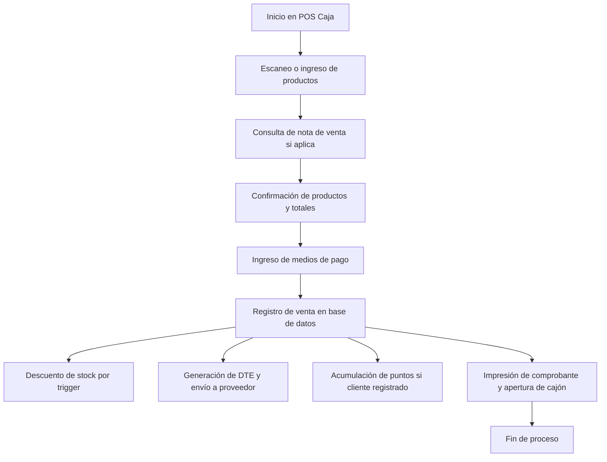

# Módulo POS Caja Registradora - Ferre-POS

## [1. Objetivo]

Ofrecer una interfaz TUI (Text User Interface) rápida, robusta y segura para el registro de ventas, pagos múltiples, emisión de documentos tributarios electrónicos (DTE) y control de periféricos, conforme a la normativa del SII.

## [2. Alcance]

- Funciona en terminal físico con teclado y lector de código de barras.
- Permite ventas con o sin nota de venta previa.
- Emite DTEs (boletas, facturas, guías) mediante integración con proveedor autorizado.
- Controla cajón de dinero e impresora térmica.
- Compatible con modo offline.

## [3. Estructura de Base de Datos]

### Triggers: actualización de stock y fidelización

```sql
-- Trigger: disminuir stock al registrar venta
CREATE OR REPLACE FUNCTION descontar_stock() RETURNS trigger AS $$
BEGIN
  UPDATE stock
  SET cantidad = cantidad - NEW.cantidad
  WHERE producto_id = NEW.producto_id AND sucursal_id = (
    SELECT sucursal_id FROM ventas WHERE id = NEW.venta_id
  );
  RETURN NEW;
END;
$$ LANGUAGE plpgsql;

CREATE TRIGGER trg_descontar_stock
AFTER INSERT ON detalle_ventas
FOR EACH ROW EXECUTE FUNCTION descontar_stock();

-- Trigger: acumular puntos si cliente está registrado
CREATE OR REPLACE FUNCTION acumular_puntos() RETURNS trigger AS $$
BEGIN
  IF NEW.cliente_rut IS NOT NULL THEN
    INSERT INTO movimientos_fidelizacion (cliente_id, sucursal_id, tipo, puntos, detalle)
    SELECT id, NEW.sucursal_id, 'acumulacion', FLOOR(NEW.total / 100), 'Venta POS'
    FROM fidelizacion_clientes
    WHERE rut = NEW.cliente_rut;
  END IF;
  RETURN NEW;
END;
$$ LANGUAGE plpgsql;

CREATE TRIGGER trg_acumular_puntos
AFTER INSERT ON ventas
FOR EACH ROW EXECUTE FUNCTION acumular_puntos();
```

### Tabla: `ventas`

```sql
CREATE TABLE ventas (
  id UUID PRIMARY KEY DEFAULT gen_random_uuid(),
  cajero_id UUID REFERENCES usuarios(id),
  sucursal_id UUID REFERENCES sucursales(id),
  nota_venta_id UUID REFERENCES notas_venta(id),
  cliente_rut TEXT,
  total NUMERIC(10,2),
  tipo_documento TEXT CHECK (tipo_documento IN ('boleta', 'factura', 'guia')),
  estado TEXT CHECK (estado IN ('finalizada', 'pendiente', 'anulada')) DEFAULT 'finalizada',
  dte_id UUID,
  fecha TIMESTAMP DEFAULT NOW()
);
```

### Tabla: `detalle_ventas`

```sql
CREATE TABLE detalle_ventas (
  id SERIAL PRIMARY KEY,
  venta_id UUID REFERENCES ventas(id),
  producto_id UUID REFERENCES productos(id),
  cantidad INTEGER,
  precio_unitario NUMERIC(10,2),
  total_item NUMERIC(10,2)
);
```

## [4. API REST]

### Registrar venta (POST)

```http
POST /api/pos-caja/venta
```

**Body:**

```json
{
  "cajero_id": "uuid",
  "nota_venta_id": "uuid",
  "cliente_rut": "11111111-1",
  "tipo_documento": "boleta",
  "productos": [
    {"producto_id": "uuid", "cantidad": 1, "precio_unitario": 1490}
  ],
  "total": 1490,
  "pagos": [
    {"medio": "efectivo", "monto": 1490}
  ]
}
```

### Consultar venta por ID (GET)

```http
GET /api/pos-caja/venta/{id}
```

## [5. Emisión DTE]

### Tabla: `documentos_dte`

```sql
CREATE TABLE documentos_dte (
  id UUID PRIMARY KEY DEFAULT gen_random_uuid(),
  tipo TEXT,
  folio INTEGER,
  estado TEXT,
  xml TEXT,
  proveedor_id UUID,
  respuesta_proveedor TEXT,
  fecha TIMESTAMP DEFAULT NOW()
);
```

- Se emite al finalizar la venta, desde caja o vía backend.
- El POS genera XML y lo envía al proveedor autorizado.
- Se almacena `dte_id` en la tabla `ventas` y se registra respuesta.

## [6. Pagos Múltiples]

- Se permite dividir el pago entre efectivo, Transbank, MercadoPago u otros.
- Se registran en tabla `pagos_venta`:

```sql
CREATE TABLE pagos_venta (
  id SERIAL PRIMARY KEY,
  venta_id UUID REFERENCES ventas(id),
  medio TEXT,
  monto NUMERIC(10,2)
);
```

## [7. Control de Periféricos]

- Apertura de cajón automático al cobrar.
- Impresión por driver CUPS o integración directa.

## [8. Modo Offline]

- Las ventas se almacenan localmente.
- Al reconectarse, se reenvían al servidor y se intenta emitir DTE si aplica.

## [9. Seguridad]

### Sistema de Roles

El POS implementa un sistema de roles basado en la tabla `usuarios`:

```sql
CREATE TYPE rol_usuario AS ENUM ('cajero', 'vendedor', 'supervisor', 'admin');

ALTER TABLE usuarios ADD COLUMN rol rol_usuario;
```

Cada endpoint valida el rol antes de permitir una acción. Por ejemplo:

- Solo `cajero` puede registrar ventas.
- Solo `supervisor` puede autorizar notas de crédito o reimpresiones tributarias.
- `admin` puede modificar configuraciones globales.

### Seguridad Avanzada

- Autenticación con JWT, con expiración configurable.
- Autorización por rol y sucursal.
- Registro de eventos críticos en logs de auditoría (`logs_seguridad`).

```sql
CREATE TABLE logs_seguridad (
  id SERIAL PRIMARY KEY,
  usuario_id UUID REFERENCES usuarios(id),
  evento TEXT,
  detalle TEXT,
  fecha TIMESTAMP DEFAULT NOW(),
  ip_origen TEXT
);
```

- Control de uso de API mediante rate limiting.

- Cifrado de tráfico por SSL/TLS en toda la comunicación con servidor central y DTE.

- Política de bloqueo de sesión tras 5 intentos fallidos consecutivos.

- Auditoría de todas las operaciones sensibles (ventas anuladas, emisión DTE, reimpresiones).

- Solo usuarios con rol `cajero` pueden registrar ventas.

- DTE requiere conexión con proveedor autorizado y firma.

## [10. UI/UX Sugerido]

- Interfaz basada en teclado (blessed).
- Pantalla dividida en:
  - escaneo/productos
  - total/pagos
  - acciones (emitir, anular, imprimir)

## [11. Integración con Notas de Crédito]

- Las ventas registradas en POS pueden ser referenciadas en una nota de crédito.
- Solo usuarios con rol `supervisor` pueden autorizar la creación.
- Se registra la relación con DTE original en `notas_credito.documento_origen_id`.
- La anulación de venta requiere emisión de nota de crédito si DTE fue generado.

## [12. Flujo Visual de Venta Completa]



## [13. Beneficios]

- Flujo rápido y seguro para ventas.
- Cumplimiento normativo SII.
- Integración con stock, fidelización y notas de venta.
- Alta confiabilidad en modo offline.

