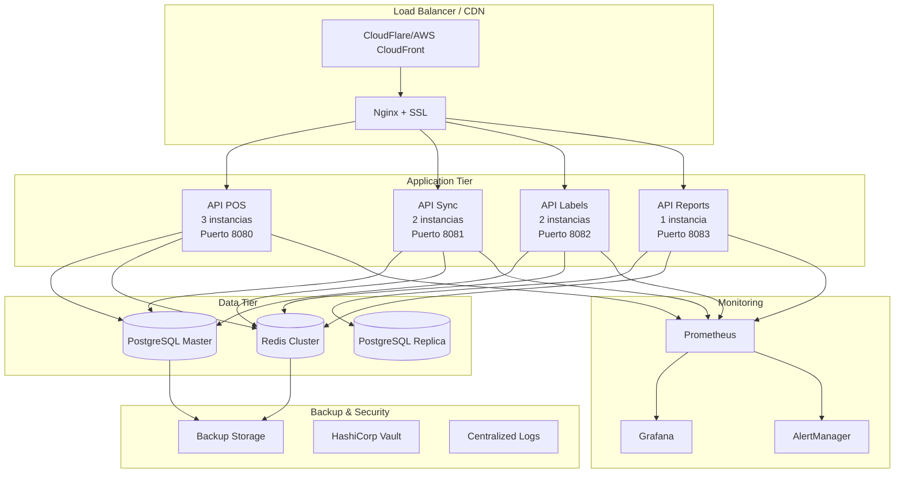

# Guía de Deployment en Producción - Ferre-POS Servidor Central Mejorado

**Autor**: Manus AI  
**Versión**: 2.0  
**Fecha**: Enero 2024  
**Estado**: Completamente Revalidado y Optimizado

## 📋 **Resumen Ejecutivo**

Esta guía proporciona instrucciones completas para el deployment en producción del sistema Ferre-POS Servidor Central completamente revalidado y mejorado. El sistema ha sido transformado en una **arquitectura de microservicios moderna** con **4 ejecutables independientes**, **notación húngara**, **observabilidad completa** y **cumplimiento total de estándares Go**.

La guía cubre desde la preparación del entorno hasta el monitoreo post-deployment, incluyendo configuraciones optimizadas para **alta disponibilidad**, **escalabilidad** y **seguridad** en entornos de producción empresarial.

## 🎯 **Objetivos del Deployment**

### **Objetivos Técnicos**
- **Alta Disponibilidad**: 99.9% uptime para APIs críticas
- **Escalabilidad**: Soporte para 1000+ requests/segundo
- **Seguridad**: Protección multicapa contra ataques
- **Observabilidad**: Monitoreo completo con alertas proactivas
- **Performance**: Latencia <100ms P95 para operaciones críticas

### **Objetivos de Negocio**
- **Continuidad Operacional**: Cero downtime durante actualizaciones
- **Crecimiento**: Capacidad para múltiples sucursales
- **Compliance**: Cumplimiento de normativas chilenas
- **Mantenimiento**: Operaciones simplificadas y automatizadas

## 🏗️ **Arquitectura de Deployment**

### **Vista General de Producción**



### **Especificaciones de Hardware**

#### **Servidor de Aplicaciones (Recomendado)**
- **CPU**: 8 cores (Intel Xeon o AMD EPYC)
- **RAM**: 32GB DDR4
- **Storage**: 500GB SSD NVMe
- **Network**: 1Gbps
- **OS**: Ubuntu 22.04 LTS o CentOS 8

#### **Servidor de Base de Datos**
- **CPU**: 16 cores (Intel Xeon o AMD EPYC)
- **RAM**: 64GB DDR4
- **Storage**: 2TB SSD NVMe (RAID 10)
- **Network**: 10Gbps
- **OS**: Ubuntu 22.04 LTS

#### **Servidor de Cache (Redis)**
- **CPU**: 4 cores
- **RAM**: 16GB DDR4
- **Storage**: 200GB SSD
- **Network**: 1Gbps
- **OS**: Ubuntu 22.04 LTS

## 🛠️ **Preparación del Entorno**

### **1. Configuración del Sistema Operativo**

#### **Ubuntu 22.04 LTS (Recomendado)**

```bash
# Actualizar sistema
sudo apt update && sudo apt upgrade -y

# Instalar dependencias básicas
sudo apt install -y \
    curl \
    wget \
    git \
    make \
    build-essential \
    ca-certificates \
    gnupg \
    lsb-release \
    htop \
    iotop \
    netstat-nat \
    ufw

# Configurar timezone
sudo timedatectl set-timezone America/Santiago

# Configurar límites del sistema
sudo tee -a /etc/security/limits.conf << EOF
# Límites para Ferre-POS
ferrepos soft nofile 65536
ferrepos hard nofile 65536
ferrepos soft nproc 32768
ferrepos hard nproc 32768
EOF

# Configurar kernel parameters
sudo tee -a /etc/sysctl.conf << EOF
# Optimizaciones para Ferre-POS
net.core.somaxconn = 65535
net.core.netdev_max_backlog = 5000
net.ipv4.tcp_max_syn_backlog = 65535
net.ipv4.tcp_keepalive_time = 600
net.ipv4.tcp_keepalive_intvl = 60
net.ipv4.tcp_keepalive_probes = 10
vm.swappiness = 10
vm.dirty_ratio = 15
vm.dirty_background_ratio = 5
EOF

sudo sysctl -p
```

### **2. Instalación de Docker y Docker Compose**

```bash
# Instalar Docker
curl -fsSL https://download.docker.com/linux/ubuntu/gpg | sudo gpg --dearmor -o /usr/share/keyrings/docker-archive-keyring.gpg

echo "deb [arch=$(dpkg --print-architecture) signed-by=/usr/share/keyrings/docker-archive-keyring.gpg] https://download.docker.com/linux/ubuntu $(lsb_release -cs) stable" | sudo tee /etc/apt/sources.list.d/docker.list > /dev/null

sudo apt update
sudo apt install -y docker-ce docker-ce-cli containerd.io docker-compose-plugin

# Configurar Docker daemon
sudo tee /etc/docker/daemon.json << EOF
{
  "log-driver": "json-file",
  "log-opts": {
    "max-size": "100m",
    "max-file": "3"
  },
  "storage-driver": "overlay2",
  "live-restore": true,
  "userland-proxy": false,
  "experimental": false,
  "metrics-addr": "127.0.0.1:9323",
  "default-ulimits": {
    "nofile": {
      "Hard": 64000,
      "Name": "nofile",
      "Soft": 64000
    }
  }
}
EOF

sudo systemctl restart docker
sudo systemctl enable docker

# Crear usuario para Ferre-POS
sudo useradd -m -s /bin/bash ferrepos
sudo usermod -aG docker ferrepos
```

### **3. Configuración de Firewall**

```bash
# Configurar UFW
sudo ufw --force reset
sudo ufw default deny incoming
sudo ufw default allow outgoing

# Permitir SSH
sudo ufw allow 22/tcp

# Permitir HTTP/HTTPS
sudo ufw allow 80/tcp
sudo ufw allow 443/tcp

# Permitir APIs (solo desde IPs específicas)
sudo ufw allow from 192.168.1.0/24 to any port 8080
sudo ufw allow from 192.168.1.0/24 to any port 8081
sudo ufw allow from 192.168.1.0/24 to any port 8082
sudo ufw allow from 192.168.1.0/24 to any port 8083

# Permitir PostgreSQL (solo desde servidores de aplicación)
sudo ufw allow from 192.168.1.10 to any port 5432

# Permitir Redis (solo desde servidores de aplicación)
sudo ufw allow from 192.168.1.10 to any port 6379

# Permitir Prometheus/Grafana (solo desde red interna)
sudo ufw allow from 192.168.1.0/24 to any port 9090
sudo ufw allow from 192.168.1.0/24 to any port 3000

sudo ufw --force enable
```

## 🗄️ **Configuración de Base de Datos**

### **PostgreSQL 15 - Configuración Master**

#### **Instalación**

```bash
# Instalar PostgreSQL 15
sudo apt install -y postgresql-15 postgresql-client-15 postgresql-contrib-15

# Configurar PostgreSQL
sudo -u postgres psql << EOF
-- Crear base de datos y usuario
CREATE DATABASE ferre_pos;
CREATE USER ferrepos_user WITH PASSWORD 'ferrepos_password_secure_2024_CHANGE_ME';
GRANT ALL PRIVILEGES ON DATABASE ferre_pos TO ferrepos_user;

-- Configurar extensiones
\c ferre_pos
CREATE EXTENSION IF NOT EXISTS "uuid-ossp";
CREATE EXTENSION IF NOT EXISTS "pg_stat_statements";
CREATE EXTENSION IF NOT EXISTS "pg_trgm";

-- Configurar permisos
GRANT ALL ON SCHEMA public TO ferrepos_user;
GRANT ALL PRIVILEGES ON ALL TABLES IN SCHEMA public TO ferrepos_user;
GRANT ALL PRIVILEGES ON ALL SEQUENCES IN SCHEMA public TO ferrepos_user;
ALTER DEFAULT PRIVILEGES IN SCHEMA public GRANT ALL ON TABLES TO ferrepos_user;
ALTER DEFAULT PRIVILEGES IN SCHEMA public GRANT ALL ON SEQUENCES TO ferrepos_user;
EOF
```

#### **Configuración de Performance**

```bash
# Configurar postgresql.conf
sudo tee -a /etc/postgresql/15/main/postgresql.conf << EOF
# Configuración optimizada para Ferre-POS

# Conexiones
max_connections = 200
superuser_reserved_connections = 3

# Memoria
shared_buffers = 8GB                    # 25% de RAM
effective_cache_size = 24GB             # 75% de RAM
work_mem = 64MB
maintenance_work_mem = 1GB
wal_buffers = 64MB

# Checkpoints
checkpoint_completion_target = 0.9
checkpoint_timeout = 15min
max_wal_size = 4GB
min_wal_size = 1GB

# Logging
log_destination = 'csvlog'
logging_collector = on
log_directory = '/var/log/postgresql'
log_filename = 'postgresql-%Y-%m-%d_%H%M%S.log'
log_rotation_age = 1d
log_rotation_size = 100MB
log_min_duration_statement = 1000
log_line_prefix = '%t [%p]: [%l-1] user=%u,db=%d,app=%a,client=%h '
log_checkpoints = on
log_connections = on
log_disconnections = on
log_lock_waits = on

# Performance
random_page_cost = 1.1                  # Para SSD
effective_io_concurrency = 200          # Para SSD
max_worker_processes = 8
max_parallel_workers_per_gather = 4
max_parallel_workers = 8
max_parallel_maintenance_workers = 4

# Autovacuum
autovacuum = on
autovacuum_max_workers = 3
autovacuum_naptime = 20s
autovacuum_vacuum_threshold = 50
autovacuum_analyze_threshold = 50
autovacuum_vacuum_scale_factor = 0.1
autovacuum_analyze_scale_factor = 0.05

# Replicación
wal_level = replica
max_wal_senders = 3
max_replication_slots = 3
hot_standby = on
hot_standby_feedback = on
EOF

# Configurar pg_hba.conf
sudo tee /etc/postgresql/15/main/pg_hba.conf << EOF
# Configuración de autenticación para Ferre-POS

# TYPE  DATABASE        USER            ADDRESS                 METHOD

# Local connections
local   all             postgres                                peer
local   all             all                                     peer

# IPv4 local connections
host    all             all             127.0.0.1/32            md5
host    all             all             ::1/128                 md5

# Aplicaciones Ferre-POS
host    ferre_pos       ferrepos_user   192.168.1.0/24          md5

# Replicación
host    replication     replicator      192.168.1.11/32         md5
EOF

sudo systemctl restart postgresql
sudo systemctl enable postgresql
```

#### **Configuración de Replica (Opcional)**

```bash
# En servidor replica
sudo -u postgres pg_basebackup -h 192.168.1.10 -D /var/lib/postgresql/15/main -U replicator -P -v -R -W

# Configurar recovery.conf
sudo -u postgres tee /var/lib/postgresql/15/main/postgresql.auto.conf << EOF
primary_conninfo = 'host=192.168.1.10 port=5432 user=replicator'
primary_slot_name = 'replica_slot'
EOF

sudo systemctl restart postgresql
```

### **Redis Cluster - Configuración**

#### **Instalación**

```bash
# Instalar Redis
sudo apt install -y redis-server

# Configurar Redis
sudo tee /etc/redis/redis.conf << EOF
# Configuración Redis para Ferre-POS

# Network
bind 0.0.0.0
port 6379
protected-mode yes
requirepass redis_password_secure_2024_CHANGE_ME

# General
daemonize yes
supervised systemd
pidfile /var/run/redis/redis-server.pid
loglevel notice
logfile /var/log/redis/redis-server.log

# Snapshotting
save 900 1
save 300 10
save 60 10000
stop-writes-on-bgsave-error yes
rdbcompression yes
rdbchecksum yes
dbfilename dump.rdb
dir /var/lib/redis

# Replication
replica-serve-stale-data yes
replica-read-only yes
repl-diskless-sync no
repl-diskless-sync-delay 5

# Memory
maxmemory 8gb
maxmemory-policy allkeys-lru
maxmemory-samples 5

# Append only file
appendonly yes
appendfilename "appendonly.aof"
appendfsync everysec
no-appendfsync-on-rewrite no
auto-aof-rewrite-percentage 100
auto-aof-rewrite-min-size 64mb

# Slow log
slowlog-log-slower-than 10000
slowlog-max-len 128

# Client output buffer limits
client-output-buffer-limit normal 0 0 0
client-output-buffer-limit replica 256mb 64mb 60
client-output-buffer-limit pubsub 32mb 8mb 60

# Security
rename-command FLUSHDB ""
rename-command FLUSHALL ""
rename-command KEYS ""
rename-command CONFIG "CONFIG_FERRE_POS_SECURE"
EOF

sudo systemctl restart redis-server
sudo systemctl enable redis-server
```

## 🚀 **Deployment de Aplicaciones**

### **1. Preparación del Código**

```bash
# Cambiar a usuario ferrepos
sudo su - ferrepos

# Clonar repositorio
git clone <repository-url> /home/ferrepos/ferre-pos-servidor-central
cd /home/ferrepos/ferre-pos-servidor-central

# Configurar variables de entorno de producción
tee .env.production << EOF
# Base de datos
STR_DB_HOST=192.168.1.10
STR_DB_PORT=5432
STR_DB_NAME=ferre_pos
STR_DB_USER=ferrepos_user
STR_DB_PASSWORD=ferrepos_password_secure_2024_CHANGE_ME
STR_DB_SSL_MODE=require

# Redis
STR_REDIS_HOST=192.168.1.11
STR_REDIS_PORT=6379
STR_REDIS_PASSWORD=redis_password_secure_2024_CHANGE_ME
STR_REDIS_DB=0

# Configuración general
STR_ENV=production
STR_LOG_LEVEL=info
STR_CONFIG_PATH=/home/ferrepos/ferre-pos-servidor-central/configs

# JWT
STR_JWT_SECRET=super_secret_jwt_key_change_in_production_2024
STR_JWT_ACCESS_DURATION=1h
STR_JWT_REFRESH_DURATION=24h

# Rate Limiting
BOOL_RATE_LIMITING_ENABLED=true
STR_RATE_LIMITING_ALGORITHM=token_bucket
INT_RATE_LIMITING_DEFAULT_LIMIT=100

# Métricas
BOOL_METRICS_ENABLED=true
STR_METRICS_PATH=/metrics

# CORS
STR_CORS_ALLOWED_ORIGINS=https://pos.ferreteria.cl,https://admin.ferreteria.cl
STR_CORS_ALLOWED_METHODS=GET,POST,PUT,DELETE,OPTIONS
STR_CORS_ALLOWED_HEADERS=Authorization,Content-Type,X-Request-ID

# SSL/TLS
BOOL_TLS_ENABLED=true
STR_TLS_CERT_FILE=/etc/ssl/certs/ferrepos.crt
STR_TLS_KEY_FILE=/etc/ssl/private/ferrepos.key
EOF
```

### **2. Configuración de Producción**

#### **Configuración Principal**

```yaml
# configs/config.production.yaml
server:
  environment: production
  debug: false
  read_timeout: 30s
  write_timeout: 30s
  idle_timeout: 120s
  max_header_bytes: 1048576

database:
  host: ${STR_DB_HOST}
  port: ${STR_DB_PORT}
  name: ${STR_DB_NAME}
  user: ${STR_DB_USER}
  password: ${STR_DB_PASSWORD}
  ssl_mode: require
  max_open_conns: 50
  max_idle_conns: 10
  conn_max_lifetime: 1h
  conn_max_idle_time: 30m

redis:
  host: ${STR_REDIS_HOST}
  port: ${STR_REDIS_PORT}
  password: ${STR_REDIS_PASSWORD}
  db: 0
  pool_size: 20
  min_idle_conns: 5
  dial_timeout: 5s
  read_timeout: 3s
  write_timeout: 3s
  pool_timeout: 4s
  idle_timeout: 5m

logging:
  level: info
  format: json
  output: both
  file:
    path: /var/log/ferrepos
    max_size: 100
    max_backups: 10
    max_age: 30
    compress: true

rate_limiting:
  enabled: true
  algorithm: token_bucket
  default_limit: 100
  default_window: 1m
  cleanup_interval: 10m
  endpoint_limits:
    "POST /auth/login": 
      limit: 10
      window: 1m
    "POST /ventas":
      limit: 50
      window: 1m
    "GET /productos/buscar":
      limit: 200
      window: 1m

security:
  jwt:
    secret: ${STR_JWT_SECRET}
    access_token_duration: 1h
    refresh_token_duration: 24h
    issuer: ferre-pos-api
  
  cors:
    allowed_origins: 
      - https://pos.ferreteria.cl
      - https://admin.ferreteria.cl
    allowed_methods: [GET, POST, PUT, DELETE, OPTIONS]
    allowed_headers: [Authorization, Content-Type, X-Request-ID]
    allow_credentials: true
    max_age: 86400

metrics:
  enabled: true
  path: /metrics
  namespace: ferre_pos
  subsystem: api
```

### **3. Build y Deployment con Docker**

#### **Build de Imágenes**

```bash
# Build de todas las imágenes
export VERSION=$(git describe --tags --always --dirty)
export BUILD_TIME=$(date -u '+%Y-%m-%d_%H:%M:%S')
export GIT_COMMIT=$(git rev-parse --short HEAD)

make docker-build \
  STR_VERSION=$VERSION \
  STR_BUILD_TIME=$BUILD_TIME \
  STR_GIT_COMMIT=$GIT_COMMIT
```

#### **Docker Compose para Producción**

```yaml
# docker-compose.production.yml
version: '3.8'

networks:
  ferre_pos_prod:
    driver: bridge
    ipam:
      config:
        - subnet: 172.20.0.0/16

volumes:
  logs_prod:
    driver: local
    driver_opts:
      type: none
      o: bind
      device: /var/log/ferrepos

services:
  # API POS - 3 instancias para alta disponibilidad
  api_pos_1:
    image: ferre-pos:${VERSION}
    container_name: ferre-pos-api-pos-1
    restart: unless-stopped
    environment:
      - STR_ENV=production
      - STR_CONFIG_PATH=/app/configs
      - INT_PORT=8080
      - STR_SERVICE_NAME=api_pos
      - STR_INSTANCE_ID=pos-1
    env_file:
      - .env.production
    ports:
      - "8080:8080"
    volumes:
      - ./configs:/app/configs:ro
      - logs_prod:/app/logs
    networks:
      ferre_pos_prod:
        ipv4_address: 172.20.0.10
    healthcheck:
      test: ["CMD", "curl", "-f", "http://localhost:8080/health"]
      interval: 30s
      timeout: 10s
      retries: 3
      start_period: 30s
    command: ["./bin/api_pos"]
    deploy:
      resources:
        limits:
          memory: 512M
          cpus: '1.0'
        reservations:
          memory: 256M
          cpus: '0.5'

  api_pos_2:
    image: ferre-pos:${VERSION}
    container_name: ferre-pos-api-pos-2
    restart: unless-stopped
    environment:
      - STR_ENV=production
      - STR_CONFIG_PATH=/app/configs
      - INT_PORT=8080
      - STR_SERVICE_NAME=api_pos
      - STR_INSTANCE_ID=pos-2
    env_file:
      - .env.production
    ports:
      - "8180:8080"
    volumes:
      - ./configs:/app/configs:ro
      - logs_prod:/app/logs
    networks:
      ferre_pos_prod:
        ipv4_address: 172.20.0.11
    healthcheck:
      test: ["CMD", "curl", "-f", "http://localhost:8080/health"]
      interval: 30s
      timeout: 10s
      retries: 3
      start_period: 30s
    command: ["./bin/api_pos"]
    deploy:
      resources:
        limits:
          memory: 512M
          cpus: '1.0'
        reservations:
          memory: 256M
          cpus: '0.5'

  api_pos_3:
    image: ferre-pos:${VERSION}
    container_name: ferre-pos-api-pos-3
    restart: unless-stopped
    environment:
      - STR_ENV=production
      - STR_CONFIG_PATH=/app/configs
      - INT_PORT=8080
      - STR_SERVICE_NAME=api_pos
      - STR_INSTANCE_ID=pos-3
    env_file:
      - .env.production
    ports:
      - "8280:8080"
    volumes:
      - ./configs:/app/configs:ro
      - logs_prod:/app/logs
    networks:
      ferre_pos_prod:
        ipv4_address: 172.20.0.12
    healthcheck:
      test: ["CMD", "curl", "-f", "http://localhost:8080/health"]
      interval: 30s
      timeout: 10s
      retries: 3
      start_period: 30s
    command: ["./bin/api_pos"]
    deploy:
      resources:
        limits:
          memory: 512M
          cpus: '1.0'
        reservations:
          memory: 256M
          cpus: '0.5'

  # API Sync - 2 instancias
  api_sync_1:
    image: ferre-pos:${VERSION}
    container_name: ferre-pos-api-sync-1
    restart: unless-stopped
    environment:
      - STR_ENV=production
      - STR_CONFIG_PATH=/app/configs
      - INT_PORT=8081
      - STR_SERVICE_NAME=api_sync
      - STR_INSTANCE_ID=sync-1
    env_file:
      - .env.production
    ports:
      - "8081:8081"
    volumes:
      - ./configs:/app/configs:ro
      - logs_prod:/app/logs
    networks:
      ferre_pos_prod:
        ipv4_address: 172.20.0.20
    healthcheck:
      test: ["CMD", "curl", "-f", "http://localhost:8081/health"]
      interval: 30s
      timeout: 10s
      retries: 3
      start_period: 30s
    command: ["./bin/api_sync"]
    deploy:
      resources:
        limits:
          memory: 256M
          cpus: '0.8'
        reservations:
          memory: 128M
          cpus: '0.3'

  api_sync_2:
    image: ferre-pos:${VERSION}
    container_name: ferre-pos-api-sync-2
    restart: unless-stopped
    environment:
      - STR_ENV=production
      - STR_CONFIG_PATH=/app/configs
      - INT_PORT=8081
      - STR_SERVICE_NAME=api_sync
      - STR_INSTANCE_ID=sync-2
    env_file:
      - .env.production
    ports:
      - "8181:8081"
    volumes:
      - ./configs:/app/configs:ro
      - logs_prod:/app/logs
    networks:
      ferre_pos_prod:
        ipv4_address: 172.20.0.21
    healthcheck:
      test: ["CMD", "curl", "-f", "http://localhost:8081/health"]
      interval: 30s
      timeout: 10s
      retries: 3
      start_period: 30s
    command: ["./bin/api_sync"]
    deploy:
      resources:
        limits:
          memory: 256M
          cpus: '0.8'
        reservations:
          memory: 128M
          cpus: '0.3'

  # API Labels - 2 instancias
  api_labels_1:
    image: ferre-pos:${VERSION}
    container_name: ferre-pos-api-labels-1
    restart: unless-stopped
    environment:
      - STR_ENV=production
      - STR_CONFIG_PATH=/app/configs
      - INT_PORT=8082
      - STR_SERVICE_NAME=api_labels
      - STR_INSTANCE_ID=labels-1
    env_file:
      - .env.production
    ports:
      - "8082:8082"
    volumes:
      - ./configs:/app/configs:ro
      - logs_prod:/app/logs
    networks:
      ferre_pos_prod:
        ipv4_address: 172.20.0.30
    healthcheck:
      test: ["CMD", "curl", "-f", "http://localhost:8082/health"]
      interval: 30s
      timeout: 10s
      retries: 3
      start_period: 30s
    command: ["./bin/api_labels"]
    deploy:
      resources:
        limits:
          memory: 128M
          cpus: '0.5'
        reservations:
          memory: 64M
          cpus: '0.2'

  api_labels_2:
    image: ferre-pos:${VERSION}
    container_name: ferre-pos-api-labels-2
    restart: unless-stopped
    environment:
      - STR_ENV=production
      - STR_CONFIG_PATH=/app/configs
      - INT_PORT=8082
      - STR_SERVICE_NAME=api_labels
      - STR_INSTANCE_ID=labels-2
    env_file:
      - .env.production
    ports:
      - "8182:8082"
    volumes:
      - ./configs:/app/configs:ro
      - logs_prod:/app/logs
    networks:
      ferre_pos_prod:
        ipv4_address: 172.20.0.31
    healthcheck:
      test: ["CMD", "curl", "-f", "http://localhost:8082/health"]
      interval: 30s
      timeout: 10s
      retries: 3
      start_period: 30s
    command: ["./bin/api_labels"]
    deploy:
      resources:
        limits:
          memory: 128M
          cpus: '0.5'
        reservations:
          memory: 64M
          cpus: '0.2'

  # API Reports - 1 instancia
  api_reports:
    image: ferre-pos:${VERSION}
    container_name: ferre-pos-api-reports
    restart: unless-stopped
    environment:
      - STR_ENV=production
      - STR_CONFIG_PATH=/app/configs
      - INT_PORT=8083
      - STR_SERVICE_NAME=api_reports
      - STR_INSTANCE_ID=reports-1
    env_file:
      - .env.production
    ports:
      - "8083:8083"
    volumes:
      - ./configs:/app/configs:ro
      - logs_prod:/app/logs
    networks:
      ferre_pos_prod:
        ipv4_address: 172.20.0.40
    healthcheck:
      test: ["CMD", "curl", "-f", "http://localhost:8083/health"]
      interval: 30s
      timeout: 10s
      retries: 3
      start_period: 30s
    command: ["./bin/api_reports"]
    deploy:
      resources:
        limits:
          memory: 1G
          cpus: '2.0'
        reservations:
          memory: 512M
          cpus: '0.8'
```

#### **Deployment**

```bash
# Deployment en producción
docker-compose -f docker-compose.production.yml up -d

# Verificar estado de servicios
docker-compose -f docker-compose.production.yml ps

# Ver logs
docker-compose -f docker-compose.production.yml logs -f api_pos_1

# Verificar salud de servicios
make health
```

## 🔧 **Configuración de Load Balancer**

### **Nginx - Configuración de Producción**

#### **Instalación y Configuración**

```bash
# Instalar Nginx
sudo apt install -y nginx

# Configuración principal
sudo tee /etc/nginx/nginx.conf << 'EOF'
user www-data;
worker_processes auto;
pid /run/nginx.pid;
include /etc/nginx/modules-enabled/*.conf;

events {
    worker_connections 4096;
    use epoll;
    multi_accept on;
}

http {
    # Basic Settings
    sendfile on;
    tcp_nopush on;
    tcp_nodelay on;
    keepalive_timeout 65;
    types_hash_max_size 2048;
    server_tokens off;
    client_max_body_size 50M;

    include /etc/nginx/mime.types;
    default_type application/octet-stream;

    # Logging Settings
    log_format main '$remote_addr - $remote_user [$time_local] "$request" '
                    '$status $body_bytes_sent "$http_referer" '
                    '"$http_user_agent" "$http_x_forwarded_for" '
                    'rt=$request_time uct="$upstream_connect_time" '
                    'uht="$upstream_header_time" urt="$upstream_response_time"';

    access_log /var/log/nginx/access.log main;
    error_log /var/log/nginx/error.log warn;

    # Gzip Settings
    gzip on;
    gzip_vary on;
    gzip_proxied any;
    gzip_comp_level 6;
    gzip_types
        text/plain
        text/css
        text/xml
        text/javascript
        application/json
        application/javascript
        application/xml+rss
        application/atom+xml
        image/svg+xml;

    # Rate Limiting
    limit_req_zone $binary_remote_addr zone=api:10m rate=10r/s;
    limit_req_zone $binary_remote_addr zone=auth:10m rate=1r/s;

    # Upstream definitions
    upstream api_pos {
        least_conn;
        server 172.20.0.10:8080 max_fails=3 fail_timeout=30s;
        server 172.20.0.11:8080 max_fails=3 fail_timeout=30s;
        server 172.20.0.12:8080 max_fails=3 fail_timeout=30s;
        keepalive 32;
    }

    upstream api_sync {
        least_conn;
        server 172.20.0.20:8081 max_fails=3 fail_timeout=30s;
        server 172.20.0.21:8081 max_fails=3 fail_timeout=30s;
        keepalive 16;
    }

    upstream api_labels {
        least_conn;
        server 172.20.0.30:8082 max_fails=3 fail_timeout=30s;
        server 172.20.0.31:8082 max_fails=3 fail_timeout=30s;
        keepalive 16;
    }

    upstream api_reports {
        server 172.20.0.40:8083 max_fails=3 fail_timeout=30s;
        keepalive 8;
    }

    include /etc/nginx/conf.d/*.conf;
    include /etc/nginx/sites-enabled/*;
}
EOF

# Configuración del sitio
sudo tee /etc/nginx/sites-available/ferre-pos << 'EOF'
server {
    listen 80;
    server_name api.ferreteria.cl;
    return 301 https://$server_name$request_uri;
}

server {
    listen 443 ssl http2;
    server_name api.ferreteria.cl;

    # SSL Configuration
    ssl_certificate /etc/ssl/certs/ferrepos.crt;
    ssl_certificate_key /etc/ssl/private/ferrepos.key;
    ssl_protocols TLSv1.2 TLSv1.3;
    ssl_ciphers ECDHE-RSA-AES256-GCM-SHA512:DHE-RSA-AES256-GCM-SHA512:ECDHE-RSA-AES256-GCM-SHA384:DHE-RSA-AES256-GCM-SHA384;
    ssl_prefer_server_ciphers off;
    ssl_session_cache shared:SSL:10m;
    ssl_session_timeout 10m;

    # Security Headers
    add_header X-Frame-Options DENY;
    add_header X-Content-Type-Options nosniff;
    add_header X-XSS-Protection "1; mode=block";
    add_header Strict-Transport-Security "max-age=31536000; includeSubDomains" always;
    add_header Referrer-Policy "strict-origin-when-cross-origin";

    # API POS - Crítica
    location /api/pos/ {
        limit_req zone=api burst=20 nodelay;
        
        proxy_pass http://api_pos/;
        proxy_http_version 1.1;
        proxy_set_header Upgrade $http_upgrade;
        proxy_set_header Connection 'upgrade';
        proxy_set_header Host $host;
        proxy_set_header X-Real-IP $remote_addr;
        proxy_set_header X-Forwarded-For $proxy_add_x_forwarded_for;
        proxy_set_header X-Forwarded-Proto $scheme;
        proxy_cache_bypass $http_upgrade;
        proxy_connect_timeout 5s;
        proxy_send_timeout 30s;
        proxy_read_timeout 30s;
    }

    # API Sync
    location /api/sync/ {
        limit_req zone=api burst=10 nodelay;
        
        proxy_pass http://api_sync/;
        proxy_http_version 1.1;
        proxy_set_header Host $host;
        proxy_set_header X-Real-IP $remote_addr;
        proxy_set_header X-Forwarded-For $proxy_add_x_forwarded_for;
        proxy_set_header X-Forwarded-Proto $scheme;
        proxy_connect_timeout 10s;
        proxy_send_timeout 60s;
        proxy_read_timeout 60s;
    }

    # API Labels
    location /api/labels/ {
        limit_req zone=api burst=5 nodelay;
        
        proxy_pass http://api_labels/;
        proxy_http_version 1.1;
        proxy_set_header Host $host;
        proxy_set_header X-Real-IP $remote_addr;
        proxy_set_header X-Forwarded-For $proxy_add_x_forwarded_for;
        proxy_set_header X-Forwarded-Proto $scheme;
        proxy_connect_timeout 10s;
        proxy_send_timeout 120s;
        proxy_read_timeout 120s;
    }

    # API Reports
    location /api/reports/ {
        limit_req zone=api burst=3 nodelay;
        
        proxy_pass http://api_reports/;
        proxy_http_version 1.1;
        proxy_set_header Host $host;
        proxy_set_header X-Real-IP $remote_addr;
        proxy_set_header X-Forwarded-For $proxy_add_x_forwarded_for;
        proxy_set_header X-Forwarded-Proto $scheme;
        proxy_connect_timeout 15s;
        proxy_send_timeout 300s;
        proxy_read_timeout 300s;
    }

    # Health checks
    location /health {
        access_log off;
        return 200 "healthy\n";
        add_header Content-Type text/plain;
    }

    # Metrics (solo desde IPs internas)
    location /metrics {
        allow 192.168.1.0/24;
        allow 172.20.0.0/16;
        deny all;
        
        proxy_pass http://api_pos/metrics;
        proxy_set_header Host $host;
        proxy_set_header X-Real-IP $remote_addr;
    }
}
EOF

# Habilitar sitio
sudo ln -sf /etc/nginx/sites-available/ferre-pos /etc/nginx/sites-enabled/
sudo rm -f /etc/nginx/sites-enabled/default

# Verificar configuración
sudo nginx -t

# Reiniciar Nginx
sudo systemctl restart nginx
sudo systemctl enable nginx
```

### **SSL/TLS - Configuración con Let's Encrypt**

```bash
# Instalar Certbot
sudo apt install -y certbot python3-certbot-nginx

# Obtener certificado SSL
sudo certbot --nginx -d api.ferreteria.cl

# Configurar renovación automática
sudo crontab -e
# Agregar línea:
# 0 12 * * * /usr/bin/certbot renew --quiet
```

## 📊 **Monitoreo y Observabilidad**

### **Prometheus - Configuración**

#### **Instalación**

```bash
# Crear usuario prometheus
sudo useradd --no-create-home --shell /bin/false prometheus

# Crear directorios
sudo mkdir /etc/prometheus
sudo mkdir /var/lib/prometheus
sudo chown prometheus:prometheus /etc/prometheus
sudo chown prometheus:prometheus /var/lib/prometheus

# Descargar Prometheus
cd /tmp
wget https://github.com/prometheus/prometheus/releases/download/v2.40.0/prometheus-2.40.0.linux-amd64.tar.gz
tar xvf prometheus-2.40.0.linux-amd64.tar.gz

# Instalar binarios
sudo cp prometheus-2.40.0.linux-amd64/prometheus /usr/local/bin/
sudo cp prometheus-2.40.0.linux-amd64/promtool /usr/local/bin/
sudo chown prometheus:prometheus /usr/local/bin/prometheus
sudo chown prometheus:prometheus /usr/local/bin/promtool

# Copiar archivos de configuración
sudo cp -r prometheus-2.40.0.linux-amd64/consoles /etc/prometheus
sudo cp -r prometheus-2.40.0.linux-amd64/console_libraries /etc/prometheus
sudo chown -R prometheus:prometheus /etc/prometheus/consoles
sudo chown -R prometheus:prometheus /etc/prometheus/console_libraries
```

#### **Configuración**

```yaml
# /etc/prometheus/prometheus.yml
global:
  scrape_interval: 15s
  evaluation_interval: 15s

rule_files:
  - "ferre_pos_rules.yml"

alerting:
  alertmanagers:
    - static_configs:
        - targets:
          - localhost:9093

scrape_configs:
  # Prometheus self-monitoring
  - job_name: 'prometheus'
    static_configs:
      - targets: ['localhost:9090']

  # Ferre-POS APIs
  - job_name: 'ferre-pos-api-pos'
    static_configs:
      - targets: 
        - '172.20.0.10:8080'
        - '172.20.0.11:8080'
        - '172.20.0.12:8080'
    metrics_path: '/metrics'
    scrape_interval: 15s
    scrape_timeout: 10s

  - job_name: 'ferre-pos-api-sync'
    static_configs:
      - targets: 
        - '172.20.0.20:8081'
        - '172.20.0.21:8081'
    metrics_path: '/metrics'
    scrape_interval: 30s

  - job_name: 'ferre-pos-api-labels'
    static_configs:
      - targets: 
        - '172.20.0.30:8082'
        - '172.20.0.31:8082'
    metrics_path: '/metrics'
    scrape_interval: 30s

  - job_name: 'ferre-pos-api-reports'
    static_configs:
      - targets: ['172.20.0.40:8083']
    metrics_path: '/metrics'
    scrape_interval: 60s

  # Node Exporter
  - job_name: 'node'
    static_configs:
      - targets: ['localhost:9100']

  # PostgreSQL Exporter
  - job_name: 'postgres'
    static_configs:
      - targets: ['localhost:9187']

  # Redis Exporter
  - job_name: 'redis'
    static_configs:
      - targets: ['localhost:9121']

  # Nginx Exporter
  - job_name: 'nginx'
    static_configs:
      - targets: ['localhost:9113']
```

#### **Reglas de Alertas**

```yaml
# /etc/prometheus/ferre_pos_rules.yml
groups:
- name: ferre_pos_alerts
  rules:
  # API Down
  - alert: FerrePoSAPIDown
    expr: up{job=~"ferre-pos-.*"} == 0
    for: 1m
    labels:
      severity: critical
    annotations:
      summary: "Ferre-POS API {{ $labels.job }} is down"
      description: "{{ $labels.job }} has been down for more than 1 minute."

  # High Error Rate
  - alert: HighErrorRate
    expr: rate(ferre_pos_http_requests_total{status=~"5.."}[5m]) > 0.05
    for: 5m
    labels:
      severity: warning
    annotations:
      summary: "High error rate on {{ $labels.job }}"
      description: "Error rate is {{ $value }} for {{ $labels.job }}"

  # High Response Time
  - alert: HighResponseTime
    expr: histogram_quantile(0.95, rate(ferre_pos_http_request_duration_seconds_bucket[5m])) > 0.5
    for: 10m
    labels:
      severity: warning
    annotations:
      summary: "High response time on {{ $labels.job }}"
      description: "95th percentile response time is {{ $value }}s"

  # Database Connection Issues
  - alert: DatabaseConnectionsHigh
    expr: ferre_pos_database_connections_active / ferre_pos_database_connections_max > 0.9
    for: 5m
    labels:
      severity: warning
    annotations:
      summary: "Database connections high"
      description: "Database connections usage is {{ $value }}%"

  # Memory Usage High
  - alert: MemoryUsageHigh
    expr: ferre_pos_system_memory_used_bytes / ferre_pos_system_memory_total_bytes > 0.8
    for: 10m
    labels:
      severity: warning
    annotations:
      summary: "Memory usage high on {{ $labels.instance }}"
      description: "Memory usage is {{ $value }}%"
```

#### **Servicio Systemd**

```bash
# Crear servicio systemd
sudo tee /etc/systemd/system/prometheus.service << EOF
[Unit]
Description=Prometheus
Wants=network-online.target
After=network-online.target

[Service]
User=prometheus
Group=prometheus
Type=simple
ExecStart=/usr/local/bin/prometheus \
    --config.file /etc/prometheus/prometheus.yml \
    --storage.tsdb.path /var/lib/prometheus/ \
    --web.console.templates=/etc/prometheus/consoles \
    --web.console.libraries=/etc/prometheus/console_libraries \
    --web.listen-address=0.0.0.0:9090 \
    --web.enable-lifecycle \
    --storage.tsdb.retention.time=30d

[Install]
WantedBy=multi-user.target
EOF

sudo systemctl daemon-reload
sudo systemctl start prometheus
sudo systemctl enable prometheus
```

### **Grafana - Configuración**

#### **Instalación**

```bash
# Instalar Grafana
wget -q -O - https://packages.grafana.com/gpg.key | sudo apt-key add -
echo "deb https://packages.grafana.com/oss/deb stable main" | sudo tee -a /etc/apt/sources.list.d/grafana.list
sudo apt update
sudo apt install -y grafana

# Configurar Grafana
sudo tee /etc/grafana/grafana.ini << EOF
[server]
http_port = 3000
domain = monitoring.ferreteria.cl
root_url = https://monitoring.ferreteria.cl

[security]
admin_user = admin
admin_password = grafana_admin_password_2024_CHANGE_ME
secret_key = grafana_secret_key_change_me_2024

[auth]
disable_login_form = false

[auth.anonymous]
enabled = false

[database]
type = sqlite3
path = grafana.db

[session]
provider = file

[analytics]
reporting_enabled = false
check_for_updates = false

[log]
mode = file
level = info
EOF

sudo systemctl start grafana-server
sudo systemctl enable grafana-server
```

#### **Dashboards Predefinidos**

Los dashboards se pueden importar desde los archivos JSON incluidos en el proyecto:

1. **Ferre-POS Overview** - Vista general del sistema
2. **API Performance** - Performance detallado de APIs
3. **Database Monitoring** - Monitoreo de PostgreSQL
4. **Business Metrics** - KPIs de negocio
5. **Infrastructure** - Métricas de sistema

## 🔐 **Backup y Recuperación**

### **Backup de Base de Datos**

#### **Script de Backup Automatizado**

```bash
#!/bin/bash
# /home/ferrepos/scripts/backup_database.sh

# Variables con notación húngara
STR_BACKUP_DIR="/backup/postgresql"
STR_DB_NAME="ferre_pos"
STR_DB_USER="ferrepos_user"
STR_DATE=$(date +%Y%m%d_%H%M%S)
STR_BACKUP_FILE="${STR_BACKUP_DIR}/ferre_pos_${STR_DATE}.sql"
STR_LOG_FILE="/var/log/ferrepos/backup.log"
INT_RETENTION_DAYS=30

# Función de logging
log_message() {
    echo "[$(date '+%Y-%m-%d %H:%M:%S')] $1" | tee -a $STR_LOG_FILE
}

# Crear directorio de backup
mkdir -p $STR_BACKUP_DIR

# Realizar backup
log_message "Iniciando backup de base de datos..."
pg_dump -h localhost -U $STR_DB_USER -d $STR_DB_NAME \
    --verbose --clean --no-owner --no-privileges \
    --format=custom --compress=9 \
    --file=$STR_BACKUP_FILE.custom

# Backup en formato SQL plano
pg_dump -h localhost -U $STR_DB_USER -d $STR_DB_NAME \
    --verbose --clean --no-owner --no-privileges \
    --file=$STR_BACKUP_FILE

if [ $? -eq 0 ]; then
    log_message "Backup completado exitosamente: $STR_BACKUP_FILE"
    
    # Comprimir backup SQL
    gzip $STR_BACKUP_FILE
    
    # Limpiar backups antiguos
    find $STR_BACKUP_DIR -name "*.sql.gz" -mtime +$INT_RETENTION_DAYS -delete
    find $STR_BACKUP_DIR -name "*.custom" -mtime +$INT_RETENTION_DAYS -delete
    
    log_message "Limpieza de backups antiguos completada"
else
    log_message "ERROR: Backup falló"
    exit 1
fi
```

#### **Configuración de Cron**

```bash
# Configurar backup automático
sudo crontab -u ferrepos -e

# Agregar líneas:
# Backup diario a las 2:00 AM
0 2 * * * /home/ferrepos/scripts/backup_database.sh

# Backup semanal completo los domingos a las 1:00 AM
0 1 * * 0 /home/ferrepos/scripts/backup_full.sh
```

### **Backup de Aplicaciones**

```bash
#!/bin/bash
# /home/ferrepos/scripts/backup_application.sh

STR_BACKUP_DIR="/backup/application"
STR_APP_DIR="/home/ferrepos/ferre-pos-servidor-central"
STR_DATE=$(date +%Y%m%d_%H%M%S)
STR_BACKUP_FILE="${STR_BACKUP_DIR}/ferre_pos_app_${STR_DATE}.tar.gz"

# Crear backup de aplicación
mkdir -p $STR_BACKUP_DIR

tar -czf $STR_BACKUP_FILE \
    --exclude='logs/*' \
    --exclude='*.log' \
    --exclude='bin/*' \
    --exclude='.git' \
    $STR_APP_DIR

echo "Backup de aplicación completado: $STR_BACKUP_FILE"
```

### **Procedimiento de Recuperación**

#### **Recuperación de Base de Datos**

```bash
# Detener aplicaciones
docker-compose -f docker-compose.production.yml down

# Restaurar desde backup custom
pg_restore -h localhost -U ferrepos_user -d ferre_pos \
    --verbose --clean --no-owner --no-privileges \
    /backup/postgresql/ferre_pos_20240115_020000.custom

# O restaurar desde backup SQL
gunzip -c /backup/postgresql/ferre_pos_20240115_020000.sql.gz | \
    psql -h localhost -U ferrepos_user -d ferre_pos

# Reiniciar aplicaciones
docker-compose -f docker-compose.production.yml up -d
```

#### **Recuperación de Aplicación**

```bash
# Extraer backup
cd /home/ferrepos
tar -xzf /backup/application/ferre_pos_app_20240115_020000.tar.gz

# Reconstruir imágenes
make docker-build

# Reiniciar servicios
docker-compose -f docker-compose.production.yml up -d
```

## 🚨 **Procedimientos de Emergencia**

### **Escalamiento Rápido**

#### **Escalamiento Horizontal**

```bash
# Escalar API POS (crítica)
docker-compose -f docker-compose.production.yml up -d --scale api_pos=5

# Escalar API Sync
docker-compose -f docker-compose.production.yml up -d --scale api_sync=3

# Verificar estado
docker-compose -f docker-compose.production.yml ps
```

#### **Escalamiento de Base de Datos**

```bash
# Aumentar conexiones PostgreSQL
sudo -u postgres psql -c "ALTER SYSTEM SET max_connections = 300;"
sudo systemctl restart postgresql

# Aumentar memoria Redis
sudo systemctl edit redis-server
# Agregar:
# [Service]
# ExecStart=
# ExecStart=/usr/bin/redis-server /etc/redis/redis.conf --maxmemory 16gb
```

### **Troubleshooting Común**

#### **API No Responde**

```bash
# Verificar estado de contenedores
docker ps -a

# Ver logs de API específica
docker logs ferre-pos-api-pos-1 --tail 100

# Verificar conectividad de red
docker network inspect ferre-pos-servidor-central_ferre_pos_prod

# Reiniciar API específica
docker restart ferre-pos-api-pos-1
```

#### **Base de Datos Lenta**

```bash
# Verificar conexiones activas
sudo -u postgres psql -c "SELECT count(*) FROM pg_stat_activity;"

# Ver queries lentas
sudo -u postgres psql -c "SELECT query, mean_time, calls FROM pg_stat_statements ORDER BY mean_time DESC LIMIT 10;"

# Verificar locks
sudo -u postgres psql -c "SELECT * FROM pg_locks WHERE NOT granted;"

# Ejecutar VACUUM si es necesario
sudo -u postgres psql -d ferre_pos -c "VACUUM ANALYZE;"
```

#### **Memoria Insuficiente**

```bash
# Verificar uso de memoria
free -h
docker stats

# Limpiar cache de sistema
sudo sync && sudo sysctl vm.drop_caches=3

# Reiniciar servicios no críticos
docker restart ferre-pos-api-reports
```

### **Rollback de Deployment**

```bash
# Rollback a versión anterior
export PREVIOUS_VERSION="v1.0.0"

# Cambiar a versión anterior
docker tag ferre-pos:$PREVIOUS_VERSION ferre-pos:latest

# Reiniciar servicios
docker-compose -f docker-compose.production.yml down
docker-compose -f docker-compose.production.yml up -d

# Verificar estado
make health
```

## 📋 **Checklist de Deployment**

### **Pre-Deployment**

- [ ] **Servidor preparado** con especificaciones mínimas
- [ ] **Sistema operativo** actualizado y configurado
- [ ] **Docker y Docker Compose** instalados
- [ ] **PostgreSQL** instalado y configurado
- [ ] **Redis** instalado y configurado
- [ ] **Nginx** instalado y configurado
- [ ] **Firewall** configurado apropiadamente
- [ ] **SSL/TLS** certificados instalados
- [ ] **Backup** de datos existentes (si aplica)

### **Deployment**

- [ ] **Código fuente** clonado y actualizado
- [ ] **Variables de entorno** configuradas
- [ ] **Configuración de producción** aplicada
- [ ] **Imágenes Docker** construidas
- [ ] **Base de datos** migrada
- [ ] **Servicios** iniciados con Docker Compose
- [ ] **Load balancer** configurado
- [ ] **Health checks** pasando

### **Post-Deployment**

- [ ] **Monitoreo** configurado (Prometheus/Grafana)
- [ ] **Alertas** configuradas y probadas
- [ ] **Backup automático** configurado
- [ ] **Logs** centralizados y rotando
- [ ] **Performance** verificado con load testing
- [ ] **Documentación** actualizada
- [ ] **Equipo** entrenado en procedimientos

### **Verificación Final**

```bash
# Verificar todos los servicios
make health

# Verificar métricas
curl -s http://localhost:9090/api/v1/query?query=up | jq

# Verificar logs
docker-compose -f docker-compose.production.yml logs --tail 10

# Test de carga básico
curl -X POST http://api.ferreteria.cl/api/pos/auth/login \
  -H "Content-Type: application/json" \
  -d '{"username":"test","password":"test"}'
```

## 📊 **Métricas de Éxito**

### **KPIs Técnicos**

- **Uptime**: >99.9% para API POS, >99.5% para otras APIs
- **Response Time**: <50ms P95 para API POS, <200ms para otras
- **Throughput**: >1000 req/s para API POS
- **Error Rate**: <0.1% para operaciones críticas
- **Recovery Time**: <5 minutos para fallos automáticos

### **KPIs de Negocio**

- **Transacciones Procesadas**: Sin pérdida de datos
- **Tiempo de Sincronización**: <30 segundos para cambios críticos
- **Generación de Reportes**: <2 minutos para reportes complejos
- **Disponibilidad del Sistema**: 24/7 sin interrupciones planificadas

## 🔮 **Próximos Pasos**

### **Optimizaciones Futuras**

1. **Kubernetes Migration**: Migrar a orquestación con Kubernetes
2. **Service Mesh**: Implementar Istio para comunicación segura
3. **Auto-scaling**: HPA y VPA para escalado automático
4. **Distributed Tracing**: Jaeger para trazabilidad completa
5. **Event-Driven Architecture**: Implementar eventos asíncronos

### **Mejoras de Seguridad**

1. **Vault Integration**: HashiCorp Vault para gestión de secretos
2. **mTLS**: Mutual TLS entre servicios
3. **Network Policies**: Segmentación de red granular
4. **Security Scanning**: Análisis automático de vulnerabilidades
5. **Compliance**: Certificaciones de seguridad

### **Observabilidad Avanzada**

1. **Distributed Tracing**: Trazas distribuidas completas
2. **Log Aggregation**: ELK Stack para logs centralizados
3. **APM**: Application Performance Monitoring
4. **Synthetic Monitoring**: Monitoreo sintético de endpoints
5. **Chaos Engineering**: Pruebas de resiliencia automatizadas

## 📚 **Referencias y Recursos**

### **Documentación Técnica**
- [Go Best Practices](https://golang.org/doc/effective_go.html)
- [Docker Production Guide](https://docs.docker.com/config/containers/resource_constraints/)
- [PostgreSQL Performance Tuning](https://wiki.postgresql.org/wiki/Performance_Optimization)
- [Nginx Performance Tuning](https://nginx.org/en/docs/http/ngx_http_core_module.html)
- [Prometheus Best Practices](https://prometheus.io/docs/practices/)

### **Herramientas de Monitoreo**
- [Grafana Dashboards](https://grafana.com/grafana/dashboards/)
- [Prometheus Exporters](https://prometheus.io/docs/instrumenting/exporters/)
- [AlertManager Configuration](https://prometheus.io/docs/alerting/latest/alertmanager/)

### **Seguridad**
- [OWASP API Security](https://owasp.org/www-project-api-security/)
- [CIS Benchmarks](https://www.cisecurity.org/cis-benchmarks/)
- [Let's Encrypt](https://letsencrypt.org/docs/)

---

**Guía desarrollada por**: Manus AI  
**Fecha de última actualización**: Enero 2024  
**Versión del sistema**: 2.0 (Completamente Revalidado)  
**Estado**: Producción Ready

*Esta guía proporciona una base sólida para el deployment en producción del sistema Ferre-POS Servidor Central mejorado. Se recomienda adaptar las configuraciones según las necesidades específicas del entorno de producción.*

